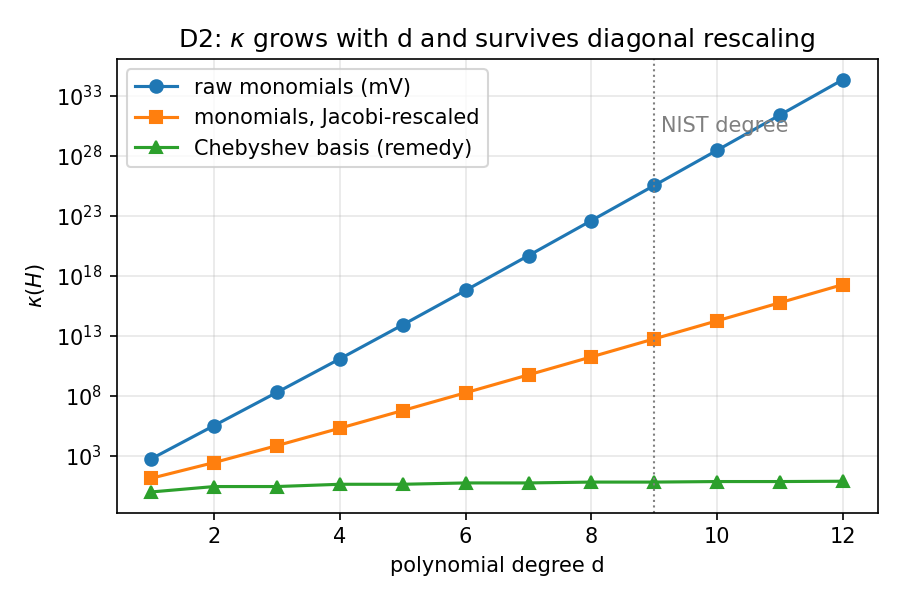
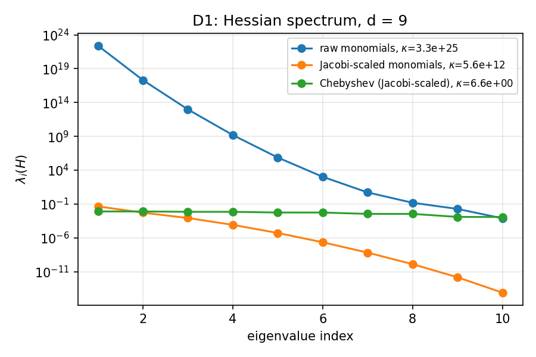
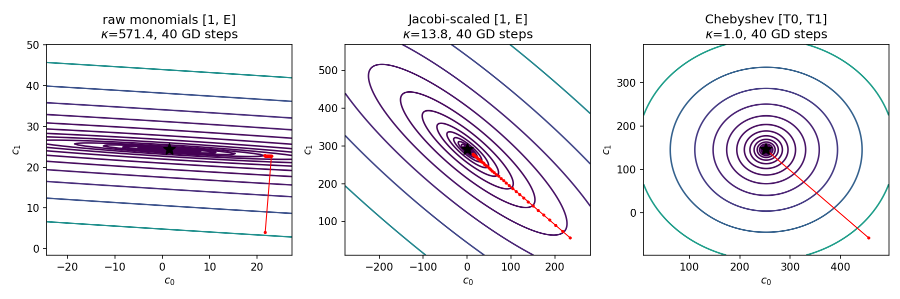
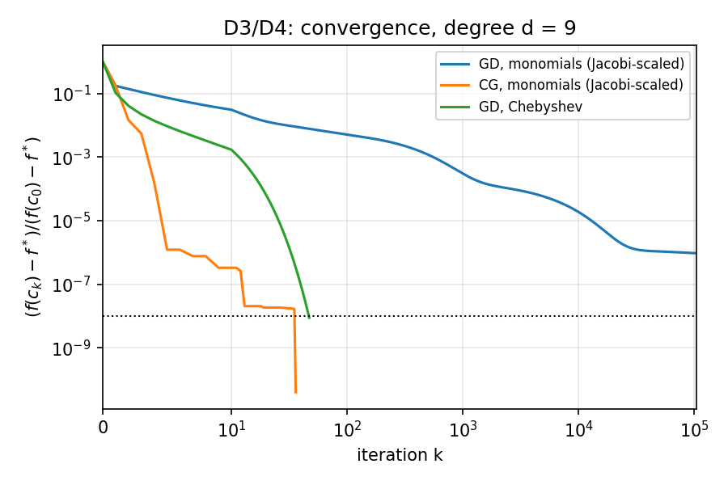

# Project 2 — Ill-Conditioned Least Squares: Thermocouple Calibration Polynomials

**Family C — correlated / multiscale features.** In linear least squares the Hessian is $H = V^\top V/m$; when the columns of the design matrix $V$ are nearly collinear or live on wildly different scales, $H$ is nearly singular and gradient methods crawl.

Reproduce everything (≈30 s, Python ≥ 3.9, `numpy`, `matplotlib`):

```bash
pip install numpy matplotlib
python project2.py
```

All numbers below are printed by the script (saved in [`results.txt`](results.txt)); all figures are written to `figs/`. The random seed is fixed (`default_rng(0)`).

---

## 1. Problem identification & motivation

A **type-K thermocouple** produces a voltage $E$ (mV) that depends nonlinearly on temperature. Every temperature controller, furnace, jet-engine test cell, and lab data logger that reads one must convert $E \to T$. The international standard (NIST ITS-90) does this with a **degree-9 polynomial in the monomial basis**,

$$T(E) = \sum_{k=0}^{9} c_k E^k, \qquad 0 \le E \le 20.644\ \text{mV}\ (0\text{–}500\,^\circ\text{C}).$$

**Decision problem:** a calibration engineer (stakeholder: instrumentation / metrology lab, or firmware that re-calibrates a sensor in the field) measures $m$ pairs $(E_i, T_i)$ and must choose the coefficients $c$ that best fit them. Because the standard prescribes the monomial form, this is the basis people actually use — and it is severely ill-conditioned. Iterative fitting (gradient descent / SGD on an embedded device, or any fit with extra regularization or constraints that rules out a direct solve) becomes impractically slow, and even direct normal-equation solves lose accuracy.

## 2. Formulation

**Data.** $m = 200$ voltages uniformly spaced on $[0, E_{\max}]$, $E_{\max}=20.644$ mV. Temperatures are generated from the published NIST type-K inverse coefficients plus Gaussian sensor noise $\sigma = 0.05\,^\circ$C (seed 0). (Sanity check in code: $T(E_{\max}) = 500.0\,^\circ$C.)

**Decision variables.** Coefficients $c = (c_0,\dots,c_d)^\top \in \mathbb{R}^{d+1}$, unbounded; units of $c_k$ are $^\circ\text{C}/\text{mV}^k$. The degree $d$ is the structural knob ($d=9$ is the NIST choice).

**Objective.** With the design matrix $V \in \mathbb{R}^{m\times(d+1)}$, $V_{ik} = \phi_k(E_i)$,

$$\min_{c\in\mathbb{R}^{d+1}} \; f(c) = \frac{1}{2m}\,\lVert Vc - y\rVert_2^2, \qquad \nabla f(c) = H c - \tfrac{1}{m}V^\top y, \qquad H = \nabla^2 f = \tfrac{1}{m}V^\top V .$$

Baseline basis: monomials, $\phi_k(E) = E^k$.

**Constraints.** None (unconstrained).

**Classification.** Unconstrained, continuous, convex quadratic program (linear least squares). The Hessian is constant, so $\kappa(H)$ fully determines first-order convergence: gradient descent with step $1/L$ satisfies

$$f(c_k)-f^* \le \left(1-\kappa^{-1}\right)^k \big(f(c_0)-f^*\big) \;\Rightarrow\; k \approx \kappa \ln(1/\varepsilon)\ \text{iterations}.$$

## 3. Ill-conditioning mechanism (family C)

Write $t = E/E_{\max} \in [0,1]$ so that $E^k = E_{\max}^k\, t^k$. Then $V = \tilde V D$, where $\tilde V_{ik} = t_i^k$ and $D = \operatorname{diag}(E_{\max}^k)$. The Hessian has **two** separate sources of ill-conditioning:

1. **Multiscale columns (the trivial, family-F part).** $D$ ranges from $1$ to $E_{\max}^9 \approx 6.8\times10^{11}$, so the diagonal of $H$ spans ~23 orders of magnitude. Diagonal rescaling removes exactly this part.
2. **Collinear columns (the intrinsic, family-C part).** For uniformly sampled $t$,

$$\big(\tfrac{1}{m}\tilde V^\top \tilde V\big)_{jk} = \frac{1}{m}\sum_i t_i^{\,j+k} \;\approx\; \int_0^1 t^{\,j+k}\,dt = \frac{1}{j+k+1},$$

   which is the **Hilbert matrix**, with $\kappa \sim e^{3.5\,(d+1)}$. The high powers $t^8, t^9$ all look alike on $[0,1]$ (flat near 0, steep near 1): the angle between the $E^8$ and $E^9$ columns is only **3.18°** (cosine 0.9985). No diagonal scaling changes angles between columns, so this part cannot be rescaled away.

### Intrinsic-κ test (D2)



| $d$ | raw monomials | Jacobi-rescaled $D^{-1/2}HD^{-1/2}$ | Chebyshev (remedy) |
|---:|---:|---:|---:|
| 1 | 5.7e2 | 1.4e1 | 1.00 |
| 2 | 3.4e5 | 2.8e2 | 2.82 |
| 3 | 2.0e8 | 7.2e3 | 2.83 |
| 5 | 8.2e13 | 6.0e6 | 4.37 |
| 7 | 4.8e19 | 5.7e9 | 5.65 |
| **9** | **3.3e25** | **5.6e12** | **6.65** |
| 12 | 2.2e34 | 1.9e17 | 7.82 |

- **Growth under refinement:** κ grows exponentially with $d$; the rescaled κ rises by about 31× per degree ($\approx e^{3.45}$), matching the Hilbert-matrix rate.
- **Survives rescaling:** symmetric Jacobi rescaling removes about 13 orders of magnitude (the unit / multiscale part) but leaves **κ = 5.6×10¹² at d = 9**. The problem passes the test: it is family C, not F.

(κ is computed from the singular values of $V$, $\kappa(H) = \sigma_{\max}^2/\sigma_{\min}^2$, because forming $V^\top V$ at $d \ge 7$ is itself numerically singular: `eigvalsh` returned negative eigenvalues.)

## 4. Effect demonstration

### D1 — spectrum at $d = 9$



The monomial eigenvalues decay geometrically: each successive direction is roughly 30× flatter than the one before it. These flat directions are coefficient combinations such as "raise $c_9$, lower $c_8$" that barely change the fitted curve.

### D3 — baseline slowdown

**Two-variable picture ($d=1$, straight-line calibration).** Forty gradient-descent steps on the same problem in three coordinate systems:



With raw monomials (κ = 571), GD drops into the narrow valley in one step and then barely moves along it. After Jacobi rescaling, κ is still 13.8 because the columns $1$ and $E$ are correlated (correlation 0.87), and GD crawls along the diagonal valley. With the Chebyshev basis the level sets are circles and GD converges in one step.

**Iterations to reach $(f-f^*)/(f_0-f^*) \le 10^{-8}$** (step $1/L$, $c_0 = 0$, cap 100,000). The GD baseline is given its best chance: it runs on the Jacobi-rescaled monomials, since raw monomials are hopeless.

| $d$ | GD, monomials (rescaled) | predicted $\approx\kappa\ln 10^8$ | GD, Chebyshev | CG, monomials | CG, Chebyshev |
|---:|---:|---:|---:|---:|---:|
| 1 | 105 | 2.5e2 | 1 | 2 | 1 |
| 2 | 1,875 | 5.2e3 | 20 | 3 | 3 |
| 3 | 31,949 | 1.3e5 | 20 | 4 | 4 |
| 4–8 | **> 100,000** | 3.8e6 – 3.3e12 | 31–47 | 5–21 | 5–9 |
| **9** | **> 100,000** | **1.0e14** | **47** | 36 | 8 |

Monomial GD iteration counts grow about 18× per degree, tracking κ as the theory predicts. At the NIST degree the bound implies roughly $10^{14}$ iterations. In practice GD stalls at a relative gap of about $10^{-6}$ after 100,000 iterations (2.4 s).

## 5. Solution — change to an orthogonal (Chebyshev) basis

**Remedy.** The mechanism is collinearity *between basis functions*, so the fix is to choose basis functions that are not collinear. Map $E$ to $s = 2E/E_{\max} - 1 \in [-1,1]$ and fit in the Chebyshev basis,

$$T(E) = \sum_{k=0}^{d} a_k\, T_k(s), \qquad T_k(\cos\theta) = \cos k\theta .$$

Chebyshev polynomials are orthogonal on $[-1,1]$, so $\tfrac1m V^\top V$ is nearly diagonal. It is not exactly diagonal because our voltage samples are uniform rather than at Chebyshev nodes, which leaves a small κ. The fitted curve is the **same polynomial**: fit RMS is 0.0472 °C in both bases. Only the coordinates change, and the monomial coefficients can be recovered afterwards with `numpy.polynomial.chebyshev.cheb2poly` if the NIST format is required.

Why this targets the mechanism: Jacobi scaling fixes column **lengths**, while an orthogonal basis fixes column **angles**. The angles are the intrinsic family-C source identified in §3.

### D4 — before vs. after



| $d = 9$ | κ(H) | GD iterations to $10^{-8}$ | wall clock |
|---|---:|---:|---:|
| Monomials, raw | 3.3e25 | — (hopeless) | — |
| Monomials, Jacobi-rescaled (baseline) | 5.6e12 | > 100,000 (stalls ≈ 1e-6) | 2.4 s |
| **Chebyshev basis** | **6.65** | **47** | **1.2 ms** |

κ drops by a factor of about $10^{12}$ relative to the rescaled baseline, and GD reaches the target over 2000× faster in wall-clock time. At $d = 5$ ([figure](figs/d3d4_convergence_d5.png)) the effect is the same: > 100,000 iterations become 32.

**Secondary comparison: conjugate gradient** (from the gradient-descent lectures). CG needs about $\sqrt\kappa$ iterations and in exact arithmetic finishes in $d+1 = 10$ steps. On rescaled monomials at $d = 9$ it takes **36** steps because rounding destroys conjugacy when κ ≈ 10¹². On the Chebyshev basis it takes **8**. CG only treats the symptom; the basis change removes the cause.

**Practical consequence beyond speed.** Solving the normal equations $V^\top V c = V^\top y$ squares the condition number of $V$. In the monomial basis the resulting calibration curve differs from the stable QR solution by up to **5.3×10⁻⁴ °C**, which is about 1% of the sensor noise and gets worse at higher degree or in float32 firmware. In the Chebyshev basis the difference is **2.3×10⁻¹² °C**.

## 6. Assumptions & simplifications

- The data is synthetic: it is generated from the published NIST type-K inverse polynomial, which makes the ground truth known, with i.i.d. Gaussian noise of 0.05 °C. Real calibration data has correlated errors and a reference-thermometer uncertainty.
- Voltages are sampled uniformly. Sampling at Chebyshev nodes, or using a Legendre basis for uniform samples, would push κ even closer to 1.
- Cold-junction compensation and the separate NIST ranges below 0 °C and above 500 °C are ignored. Only the 0–500 °C segment is fitted.
- All computation is float64. Firmware using float32 would lose accuracy much sooner in the monomial basis.
- The GD step is the fixed optimal $1/L$ with $c_0 = 0$. Iteration counts depend on the starting point, but their scaling with κ does not.
- Degree is used as the refinement knob. The number of samples $m$ barely changes κ, because the Gram matrix converges to the Hilbert matrix as $m\to\infty$.
